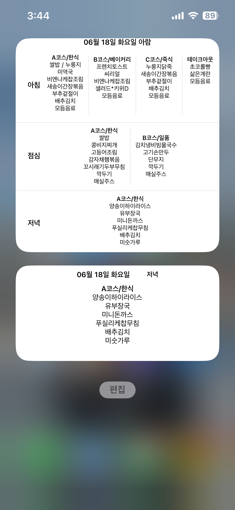
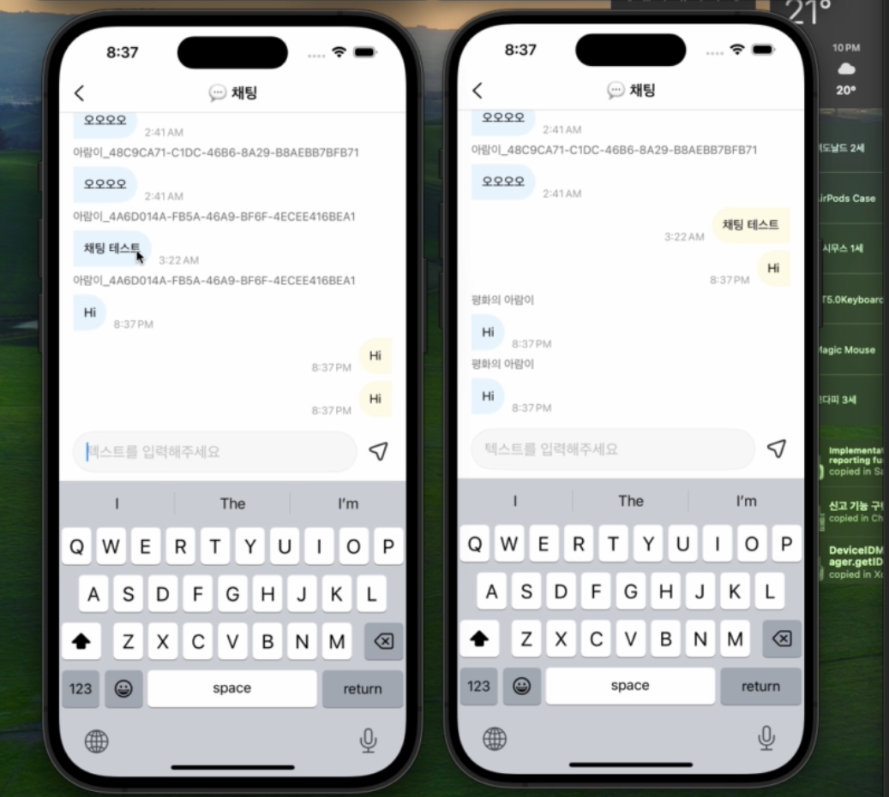

# 아람별 서비스

## 목차

- [1. 서비스 소개](#1-서비스-소개)
- [2. 서비스 기능 소개](#2-서비스-기능-소개)
- [3. 서비스 성과](#3-서비스-성과)
- [4. 서비스 설계](#4-서비스-개발)
    - [4.1 ELK 스택을 이용한 로깅 파이프라인 구축](#41-elk-스택을-이용한-로깅-파이프라인-구축)

## 1. 서비스 소개

[아람별 - App Store 앱](https://apps.apple.com/kr/app/%EC%95%84%EB%9E%8C%EB%B3%84/id6446250930)

아람별은 경상대학교 기숙사 식당 메뉴 정보 제공 서비스입니다.
기숙사 식당 메뉴 확인이 어려운 학생들을 위하여 , iOS앱 & 위젯 & 웹으로 구현되었습니다.
현재는 400명이상의 재학생들이 사용 중입니다.

## 2. 서비스 기능 소개

주요 기능은 식단 메뉴 확인 , 채팅 기능이 있습니다.

  
  

► 식단 메뉴 확인

모바일과 위젯으로 식단 메뉴를 확인할 수 있습니다.

► 채팅 기능

재학생들끼리 , 오늘 밥의 맛은 어떤 지 , 식당에 뭐가 나왔는지 등을 자유롭게 채팅할 수 있습니다.

## 3. 서비스 성과

iOS 다운로드 수 : 420명 +

## 4. 서비스 개발

- 아람별 iOS Version 1.0을 개발하였습니다.
- 아람별 사용자 접속 패턴 파악을 위해 ELK 스택을 이용하여 로깅 파이프라인을 구축하여습니다.
- 아람별 커뮤니티를 위한 채팅 기능을 개발하였습니다.
- 현재 Repository는 로깅에 관한 코드만 포함되어 있습니다.

### 4.1 ELK 스택을 이용한 로깅 파이프라인 구축

**ELK 스택** ((Filebeat + ) Elasticsearch, Logstash, Kibana)을 사용하여 사용자 접속 로그를 수집, 처리, 저장 및 시각화하는 로그 파이프라인을 구축하였습니다.
이 시스템은 웹, 안드로이드, iOS 플랫폼에서 발생하는 사용자 접속 로그를 분석하여 사용자 활동을 모니터링하고 시각화합니다.

#### 로그 수집 및 분석

1. **로그 수집**:
    - **웹, 안드로이드, iOS** 애플리케이션에서 발생하는 사용자 접속 로그를 수집합니다.
    - 각 플랫폼에서는 로그를 중앙 서버로 전송하여 일관된 로그 형식을 유지합니다.
    

2. **로그 전송 및 처리**:
    - **Filebeat**: 로그 파일을 모니터링하고 로그 데이터를 Logstash로 전송합니다.
    - **Logstash**: 로그 데이터를 수집하고 필요한 필터링 및 변환 작업을 수행하여 Elasticsearch에 적재할 준비를 합니다.
    

3. **데이터 저장**:
    - **Elasticsearch**: Logstash에서 처리된 데이터를 저장하고, 빠르고 효율적인 검색을 지원합니다.
    

4. **데이터 시각화**:
    - **Kibana**: Elasticsearch에 저장된 데이터를 시각화하여 대시보드와 리포트를 생성합니다. 이를 통해 사용자 접속 패턴과 트렌드를 분석하고 인사이트를 도출할 수 있습니다.

과정을 기록한 블로그입니다. -  [ELK 스택을 이용한 로깅 파이프라인 구축](https://gani-dev.tistory.com/category/개발일지/ELK)